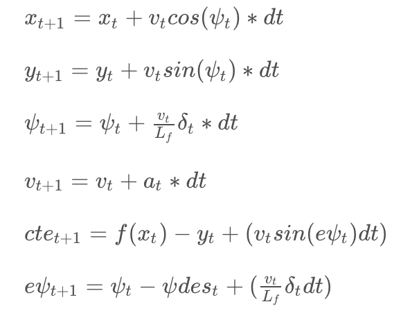
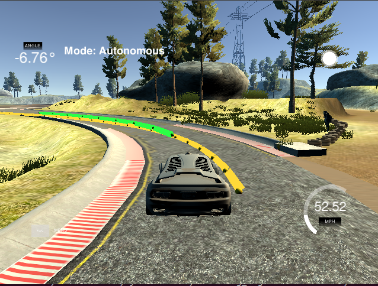
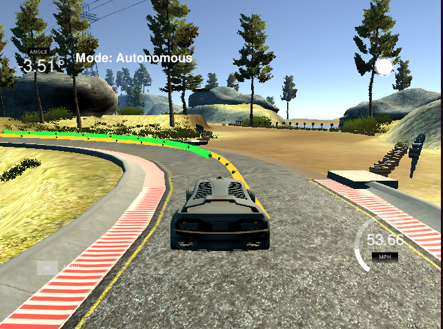

# CarND-Controls-MPC
Self-Driving Car Engineer Nanodegree Program

My solution is contained in these files: [main](src/main.cpp) [MPC](src/MPC.cpp)

My code is calculating tracking points in order to steer the udacity simulated car to drive on the track.

---
## The Model
Used the following kinematic vehicle model:

`x = position of the car along x-axis
y = position of the car along y-axis
v = velocity of the car
psi = direction of the car
delta = steering direction
dt = latency or elapsed time
a = acceleration / deceleration throttle
epsi = error in orientation
cte = cross track error`

## Polynomial Fitting and MPC Preprocessing
Moved and rotated the vehicle points, in order to convert from the vehcile coordinate system into the global coordinate system, which is more understandable in practice.

## Timestep Length and Elapsed Duration (N & dt)
I chose N (timestep length) = 10 and and dt (elapsed duration between timesteps) as 0.1, in order to get 10 values totalling a one second.

1) a smaller dt gives finer resolution, in order to make fine-tuned decisions.
2) a larger N, will be computationally more expensive, taking longer to finish, which can cause the car to crash.

## Model Predictive Control with Latency

MPC is works well as it is when there is no latency. But in this project we are introducing a latency of 100ms. If we do not model this latency in MPC we will we sending actuation commands that are 100ms too late. In order to circumvent this latency, we will use kinematic equations to predict where the car will be in 100ms and what actuator values we should request the car to take.

They are coded [here](main.cpp#L133)

## Simulation
I am able to get very good results, I am able to go around the track without the car leaving the drivable portion of the track surface.

